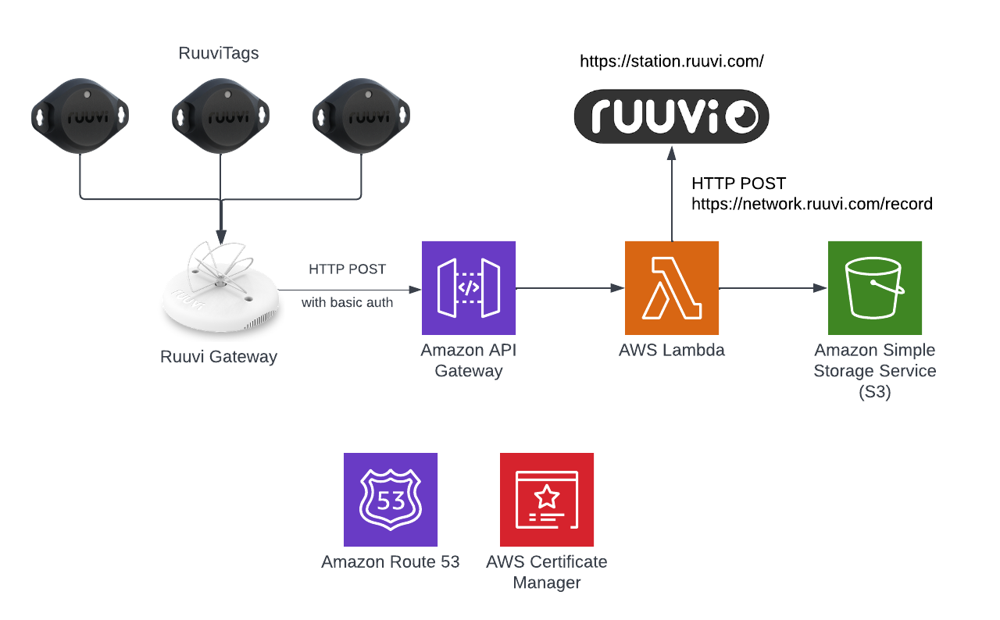

# Ruuvi API Proxy

A serverless API proxy for Ruuvi Gateway devices that provides local data storage while maintaining compatibility with the Ruuvi Cloud Gateway API.

## Features

- **Ruuvi Cloud Compatibility**: Drop-in replacement for Ruuvi Cloud Gateway API
- **Local Data Storage**: Store sensor data in your own AWS account
- **Dynamic Forwarding**: Optionally forward data to Ruuvi Cloud
- **Serverless Architecture**: Cost-effective scaling with AWS Lambda and DynamoDB
- **Real-time Monitoring**: CloudWatch dashboards and alarms
- **RESTful API**: Access stored data via REST endpoints
- **Environment Management**: Support for dev, staging, and production environments
- **Automated Deployment**: Complete CI/CD pipeline with rollback capabilities

## Architecture

The system uses:
- **API Gateway**: HTTP endpoints with authentication and rate limiting
- **AWS Lambda**: Serverless compute for data processing (Python 3.11)
- **DynamoDB**: NoSQL database for sensor data and configuration storage
- **CloudWatch**: Comprehensive monitoring, logging, and alerting
- **S3**: Lambda function deployment packages
- **Route53 + ACM**: Custom domain with SSL certificates



## Quick Start

### 1. Deploy the System

```bash
# Deploy to production
make deploy-prod

# Or deploy to development
make deploy-dev

# Or deploy to staging
make deploy-staging
```

### 2. Get API Keys

```bash
# Get all stack outputs including API keys
aws cloudformation describe-stacks --stack-name ruuvi-api-prod --query 'Stacks[0].Outputs'

# Get the actual API key values
aws apigateway get-api-key --api-key YOUR_GATEWAY_API_KEY_ID --include-value
aws apigateway get-api-key --api-key YOUR_ADMIN_API_KEY_ID --include-value
```

### 3. Configure Your Ruuvi Gateway

Update your Ruuvi Gateway configuration to use the proxy endpoint:

```json
{
  "api_endpoint": "https://ruuvi-api-prod.carriagereturn.nl/api/v1",
  "api_key": "YOUR_GATEWAY_API_KEY"
}
```

### 4. Access Your Data

```bash
# List all devices
curl -H "x-api-key: YOUR_ADMIN_API_KEY" \
     https://ruuvi-api-prod.carriagereturn.nl/api/v1/local/devices

# Get current data for a device
curl -H "x-api-key: YOUR_ADMIN_API_KEY" \
     https://ruuvi-api-prod.carriagereturn.nl/api/v1/local/data/current/AA:BB:CC:DD:EE:FF
```

## API Endpoints

### Proxy Endpoint (Ruuvi Cloud Compatible)
- `POST /api/v1/data` - Receive sensor data from Ruuvi Gateway devices

### Local Data Access
- `GET /api/v1/local/devices` - List all devices with metadata
- `GET /api/v1/local/data/current/{device_id}` - Get most recent readings
- `GET /api/v1/local/data/history/{device_id}` - Get historical data with pagination

### Configuration Management
- `GET /api/v1/config/forwarding` - Get current forwarding configuration
- `PUT /api/v1/config/forwarding` - Enable/disable Ruuvi Cloud forwarding

## Documentation

### Setup and Deployment
- [**Deployment Guide**](DEPLOYMENT.md) - Complete deployment and management guide
- [**Ruuvi Gateway Setup**](docs/RUUVI_GATEWAY_SETUP.md) - Configure your Ruuvi Gateway devices

### API and Usage
- [**API Reference**](docs/API_REFERENCE.md) - Complete API documentation with examples
- [**Configuration Guide**](docs/CONFIGURATION_GUIDE.md) - System configuration management

### Operations and Maintenance
- [**Troubleshooting Guide**](docs/TROUBLESHOOTING.md) - Common issues and solutions
- [**Architecture Documentation**](ARCHITECTURE.md) - System architecture details

## Development

### Prerequisites
- Python 3.11+
- AWS CLI configured with appropriate permissions
- Make utility for build automation

### Environment Setup
```bash
# Install Python dependencies
make install

# Install development tools
pip install -r requirements.txt
```

### Local Development Workflow
```bash
# Run all tests
make test

# Run only unit tests
make test-unit

# Run only integration tests
make test-integration

# Lint code
make lint

# Format code
make format

# Build Lambda packages
make package

# Deploy to development environment
make deploy-dev
```

### Project Structure
```
├── src/                    # Lambda function source code
│   ├── proxy/             # Proxy function (Ruuvi Cloud compatibility)
│   ├── retrieve/          # Data retrieval function
│   ├── config/            # Configuration management function
│   └── shared/            # Shared utilities and models
├── tests/                 # Test suites
│   ├── unit/             # Unit tests
│   └── integration/      # Integration tests
├── scripts/              # Deployment and utility scripts
├── config/               # Environment-specific configurations
├── docs/                 # Documentation
└── rollback/            # Rollback information files
```

## Deployment Environments

### Development Environment
- **Purpose**: Feature development and testing
- **Configuration**: Shorter data retention, forwarding disabled
- **Access**: `https://ruuvi-api-dev.carriagereturn.nl`

### Staging Environment
- **Purpose**: Pre-production testing and validation
- **Configuration**: Production-like settings with test data
- **Access**: `https://ruuvi-api-staging.carriagereturn.nl`

### Production Environment
- **Purpose**: Live system for production data
- **Configuration**: Optimized for performance and reliability
- **Access**: `https://ruuvi-api-prod.carriagereturn.nl`

## Monitoring and Observability

### CloudWatch Dashboard
Each environment includes a comprehensive dashboard showing:
- Lambda function performance metrics
- API Gateway request/error rates
- DynamoDB capacity and throttling
- Custom business metrics (forwarding success/failure)

### Alarms and Alerting
Automated alarms for:
- High error rates (>5%)
- Lambda function timeouts
- DynamoDB throttling
- Ruuvi Cloud API failures

### Logging
Structured logging across all components:
```bash
# View proxy function logs
make logs-proxy-dev

# View retrieve function logs  
make logs-retrieve-dev

# View configuration function logs
make logs-config-dev
```

## Configuration Management

### Dynamic Configuration
The system supports runtime configuration changes without redeployment:

```bash
# Enable forwarding to Ruuvi Cloud
curl -X PUT \
  -H "x-api-key: YOUR_ADMIN_API_KEY" \
  -H "Content-Type: application/json" \
  -d '{"enabled": true}' \
  https://ruuvi-api-prod.carriagereturn.nl/api/v1/config/forwarding

# Disable forwarding (local storage only)
curl -X PUT \
  -H "x-api-key: YOUR_ADMIN_API_KEY" \
  -H "Content-Type: application/json" \
  -d '{"enabled": false}' \
  https://ruuvi-api-prod.carriagereturn.nl/api/v1/config/forwarding
```

### Environment-Specific Settings
Each environment has its own configuration file in `config/`:
- `config/dev.json` - Development settings
- `config/staging.json` - Staging settings
- `config/prod.json` - Production settings

## Cost Optimization

### Serverless Benefits
- **Pay-per-request**: No charges when idle
- **Automatic scaling**: Scales to zero when not in use
- **No infrastructure management**: Fully managed services

### Estimated Monthly Costs
For typical usage (handful of users):
- **API Gateway**: $1-5
- **Lambda**: $2-5
- **DynamoDB**: $3-12
- **CloudWatch**: $1-2
- **Data Transfer**: $1-3
- **Total**: $8-27/month

### Cost Monitoring
- CloudWatch billing alarms
- DynamoDB on-demand pricing
- Automatic data cleanup with TTL

## Security Features

### Authentication and Authorization
- **API Keys**: Separate keys for gateways and admin access
- **IAM Roles**: Least-privilege access for Lambda functions
- **Rate Limiting**: Configurable rate limits per API key

### Data Protection
- **HTTPS Only**: All endpoints require HTTPS
- **Encryption**: Data encrypted in transit and at rest
- **Network Security**: VPC endpoints available for enhanced security

### Audit and Compliance
- **Configuration Audit**: All configuration changes logged
- **Access Logging**: API Gateway access logs
- **CloudTrail Integration**: AWS API call logging

## Backup and Recovery

### Automated Backups
- **DynamoDB**: Point-in-time recovery enabled
- **Configuration**: Automatic backup before deployments
- **Lambda Code**: Versioned in S3

### Rollback Procedures
```bash
# Create rollback script
make rollback

# Execute rollback to previous version
python scripts/rollback.py rollback/prod-20241201-143022.json
```

### Disaster Recovery
- **Multi-AZ**: DynamoDB automatically replicated
- **Cross-Region**: Can be deployed to multiple regions
- **Data Export**: Tools for data migration and export

## Performance Characteristics

### Throughput
- **API Gateway**: 10,000 requests per second
- **Lambda**: 1,000 concurrent executions (default)
- **DynamoDB**: On-demand scaling

### Latency
- **Proxy Function**: <100ms typical response time
- **Data Retrieval**: <200ms for current data, <500ms for historical
- **Configuration**: <50ms for cached values

### Scalability
- **Horizontal**: Automatic scaling based on demand
- **Vertical**: Configurable Lambda memory/CPU
- **Storage**: Unlimited DynamoDB capacity

## Integration Examples

### Python SDK
```python
from ruuvi_api_client import RuuviAPIClient

client = RuuviAPIClient(
    "https://ruuvi-api-prod.carriagereturn.nl",
    "your-admin-api-key"
)

# Get all devices
devices = client.get_devices()

# Get current data
current = client.get_current_data("AA:BB:CC:DD:EE:FF")

# Get historical data
history = client.get_historical_data(
    "AA:BB:CC:DD:EE:FF",
    start_time=datetime.now() - timedelta(days=1),
    end_time=datetime.now()
)
```

### JavaScript/Node.js
```javascript
const client = new RuuviAPIClient(
    'https://ruuvi-api-prod.carriagereturn.nl',
    'your-admin-api-key'
);

// Get devices and current data
const devices = await client.getDevices();
const current = await client.getCurrentData(devices.devices[0].device_id);
```

## Contributing

### Development Process
1. Fork the repository
2. Create a feature branch: `git checkout -b feature/new-feature`
3. Make your changes with tests
4. Run the test suite: `make test`
5. Submit a pull request

### Code Standards
- **Python**: Follow PEP 8 style guide
- **Testing**: Maintain >90% code coverage
- **Documentation**: Update docs for new features
- **Linting**: Code must pass `make lint`

### Testing Requirements
- Unit tests for all new functions
- Integration tests for API endpoints
- Performance tests for critical paths
- Security tests for authentication

## Troubleshooting

### Quick Diagnostics
```bash
# Check system health
make status-prod

# View recent errors
aws logs filter-log-events \
  --log-group-name /aws/lambda/ruuvi-api-prod-proxy \
  --filter-pattern "ERROR" \
  --start-time $(date -d '1 hour ago' +%s)000

# Test API connectivity
curl -I https://ruuvi-api-prod.carriagereturn.nl/api/v1/local/devices
```

### Common Issues
- **Gateway Connection**: Check API keys and network connectivity
- **Data Not Appearing**: Verify DynamoDB permissions and table access
- **Performance Issues**: Monitor Lambda metrics and DynamoDB throttling
- **Configuration Problems**: Check configuration table and caching

See the [Troubleshooting Guide](docs/TROUBLESHOOTING.md) for detailed solutions.

## License

This project is licensed under the MIT License - see the [LICENSE](LICENSE) file for details.

## Support and Community

### Getting Help
1. **Documentation**: Check the comprehensive docs in the `docs/` directory
2. **Issues**: Open a GitHub issue for bugs or feature requests
3. **Discussions**: Use GitHub Discussions for questions and ideas

### Resources
- [Ruuvi Documentation](https://docs.ruuvi.com/)
- [AWS Lambda Documentation](https://docs.aws.amazon.com/lambda/)
- [DynamoDB Documentation](https://docs.aws.amazon.com/dynamodb/)
- [API Gateway Documentation](https://docs.aws.amazon.com/apigateway/)

### Roadmap
- [ ] Multi-region deployment support
- [ ] Enhanced analytics and reporting
- [ ] Mobile app integration
- [ ] Advanced alerting and notifications
- [ ] Data export and migration tools

---

**Built with ❤️ for the Ruuvi community**