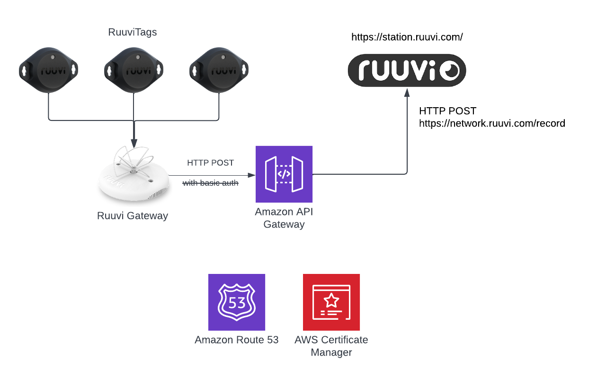

# AWS API for collecting data from Ruuvi Gateways

Bill-of-materials for a simple proxy to forward HTTP POSTs to Ruuvi API

* [Amazon API Gateway](https://aws.amazon.com/api-gateway/)
* [Amazon Route 53](https://aws.amazon.com/route53/) (optional)
* [AWS Certificate Manager](https://aws.amazon.com/certificate-manager/) (optional)

Misc resources

* https://jsonplaceholder.typicode.com/
* https://cjohansen.no/aws-apigw-proxy-cloudformation/
